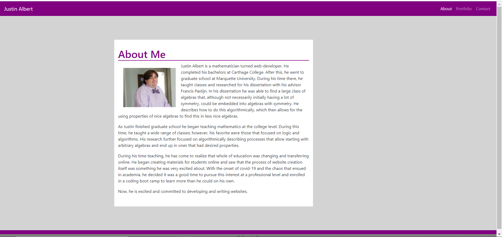

# Portfolio

This work is completed as an assignment for a coding bootcamp.

The goal of this project is to create a portfolio providing my personal information and examples and links to my web development work.  There are three pages with an about me page, a contact page and a portfolio page.  This deployed website is [here](https://jalbert12485.github.io/portfolio/).
